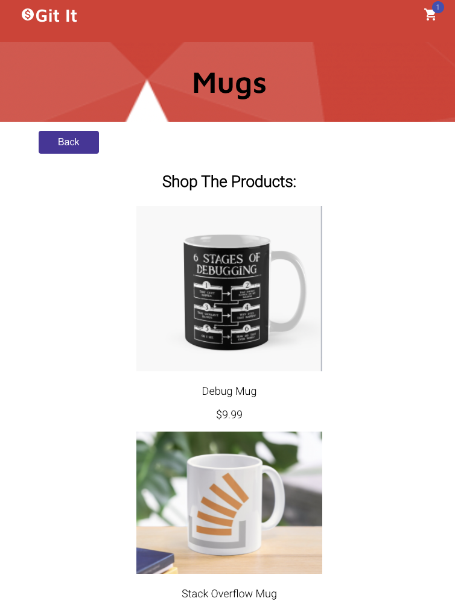
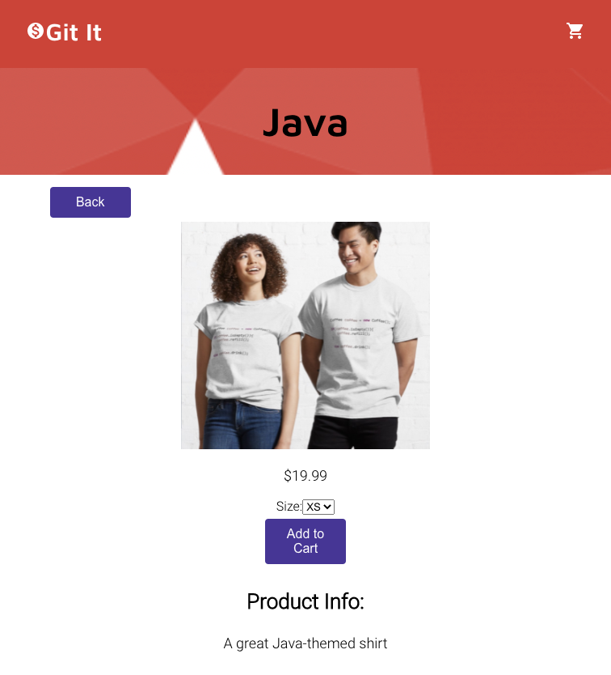
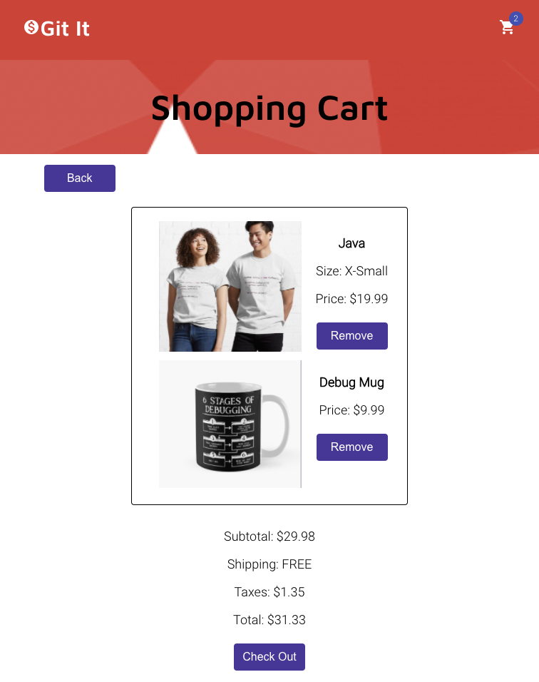

# Git It

## Summary

Git It is a full-stack PERN app designed as a mock coding-related merch site. The user is able to view products, add and delete items from their shopping cart and complete a demo checkout process.

The GitIt API utilizes GET, POST and DELETE endpoints along with the corresponding postgreSQL databases. The app's client-side was also written by me and can be viewed [here](https://github.com/SabrinaSides/git-it-client).

## See the App Live

[Check It Out Here](https://git-it-sabrinasides.vercel.app/)

## Tech Stack

**Client:** React, JavaScript, CSS

**Server:** Node, Express, PostgreSQL

[View the Client Repo](https://github.com/SabrinaSides/git-it-client)

## API Endpoints

**/api/products:** GET

**/api/shoppingCart:** GET, POST, DELETE

## Screenshots

### Home Page

### Category Page: Mugs

### Product Page

### Shopping Cart

